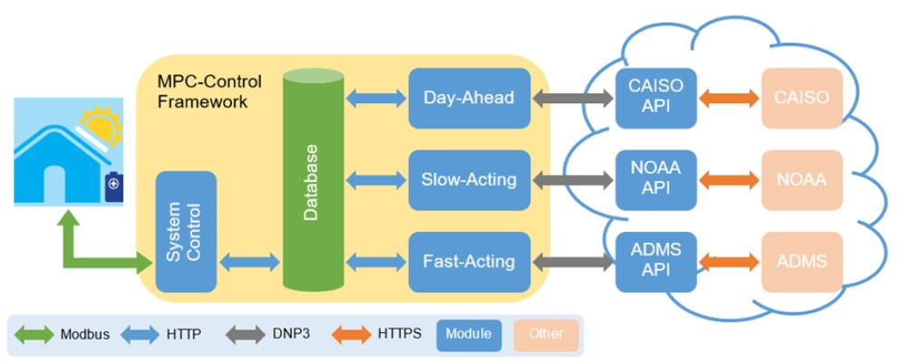

# DOPER
#### Distributed Optimal and Predictive Energy Resources
-------------------------------------------------------------------------

This package is an optimal control framework for behind-the-meter battery storage, Photovoltaic generation, and other Distributed Energy Resources.

## General
The DOPER controller is implemented as a [Model Predictive Control](https://facades.lbl.gov/model-predictive-controls) (MPC), where an internal mathematical model is evaluated and solved to a global optimum, at each controller evaluation. The inputs are forecasts of weather data, Photovoltaic (PV) generation, and load for the upcoming 24 hours. The objective is to maximize the revenue (by minimizing the total energy cost) for the asset owner, while providing additional services to the grid. The grid services explored include time-varying pricing schemes and the response to critical periods in the grid. DOPER can optimally control the battery by charging it during periods with excess generation and discharging it during the critical afternoon hours (i.e. [Duck Curve](https://en.wikipedia.org/wiki/Duck_curve)). This active participation in the grid management helps to maximize the amount of renewables that can be connected to the grid.

The DOPER controller was evaluated in annual simulations and in a field test conducted at the Flexgrid test facility at LBNL. The following plot shows example results for a field test conducted at LBNL's [FLEXGRID](https://flexlab.lbl.gov/introducing-flexgrid) facility. The base load without energy storage is shown in turquoise, the computed optimal result in purple, and the measured load in yellow.

Peak demand and total energy cost was significantly reduced. Annual simulations indicate cost savings of up to 35 percent, with a payback time of about 6 years. This is significantly shorter than the lifetime of typical batteries.

Further information can be found in the full project report listed in the **Cite** section.

## Getting Started
The following link permits users to clone the source directory containing the [DOPER](https://github.com/LBNL-ETA/DOPER) package.

The package depends on external modules which can be installed from pypi with `pip install -r requirements.txt`.

## Example
To illustrate the DOPER functionality, example Jupyter notebooks can be found [here](Examples).

[Test 1](Examples/Test1.ipynb) *In development*.

## License
Distributed Optimal and Predictive Energy Resources (DOPER) Copyright (c) 2019, The Regents of the University of California, through Lawrence Berkeley National Laboratory (subject to receipt of any required approvals from the U.S. Dept. of Energy).  All rights reserved.

If you have questions about your rights to use or distribute this software, please contact Berkeley Lab's Intellectual Property Office at IPO@lbl.gov.

NOTICE.  This Software was developed under funding from the U.S. Department of Energy and the U.S. Government consequently retains certain rights.  As such, the U.S. Government has been granted for itself and others acting on its behalf a paid-up, nonexclusive, irrevocable, worldwide license in the Software to reproduce, distribute copies to the public, prepare derivative works, and perform publicly and display publicly, and to permit other to do so.

## Cite
To cite the DOPER package, please use:

*Gehbauer, Christoph, Müller, J., Swenson, T. and Vrettos, E. 2019. Photovoltaic and Behind-the-Meter Battery Storage: Advanced Smart Inverter Controls and Field Demonstration. California Energy Commission.*